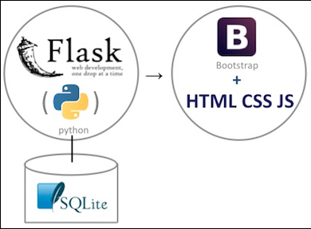
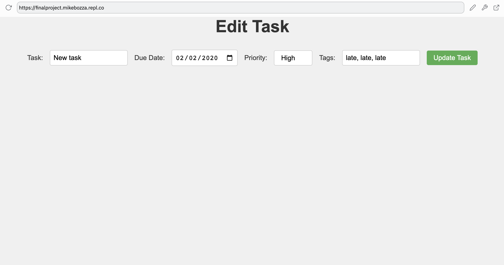
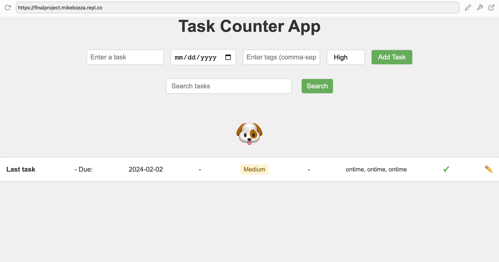
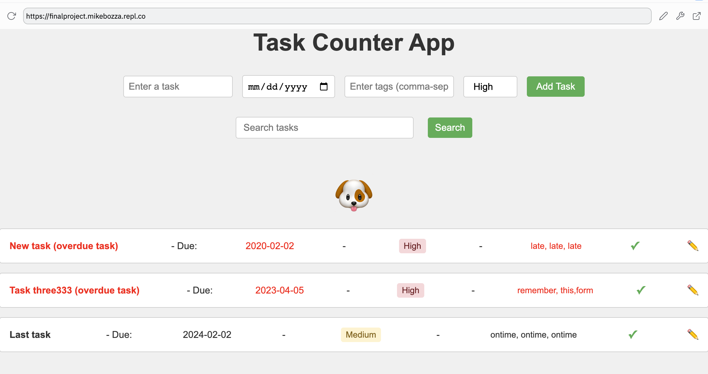

# TaskMaster

TaskMaster is a simple and efficient task management web app designed to help users organize and prioritize their tasks with ease. Our goal was to create a user-friendly tool that streamlines task organization, allowing users to focus on what's important.

## Getting Started

To get started with TaskMaster, follow these steps:

1. Download or clone the project repository from [GitHub Link]
2. Install the required dependencies: `pip install -r requirements.txt`
3. Run the application: `python main.py`
4. Open a web browser and navigate to http://localhost:5000

For more detailed instructions and troubleshooting, please refer to the README file in the project repository.

## Implementation Information

TaskMaster is built using Python and the Flask web framework, with SQLite as the database. The app uses SQLAlchemy for database interactions and Jinja2 for templating. The following flowchart illustrates the app's architecture and main components:


A key feature of the app is the ability to search for tasks. The search functionality is implemented using a simple query filter:

```python
search_term = request.form.get('search')
tasks = Task.query.filter(Task.task.contains(search_term)).all()
```

### Results


TaskMaster offers an intuitive interface for users to create, edit, and manage tasks. Here are some screenshots showcasing the app's features:







## Project Evolution/Narrative

The development of TaskMaster went through several stages, starting with basic task creation and completion. As the project evolved, new features were added, such as due dates, priority levels, and tags. The user interface was also refined to improve the user experience. The following images illustrate the project's evolution:


### Attribution


TaskMaster was made possible by the following resources and technologies:

-   Flask web framework: <https://flask.palletsprojects.com/>
-   SQLAlchemy ORM: <https://www.sqlalchemy.org/>
-   Jinja2 templating engine: <https://jinja.palletsprojects.com/>
-   OpenAI's GPT-4: <https://www.openai.com/gpt-4/> (for initial code assistance)


